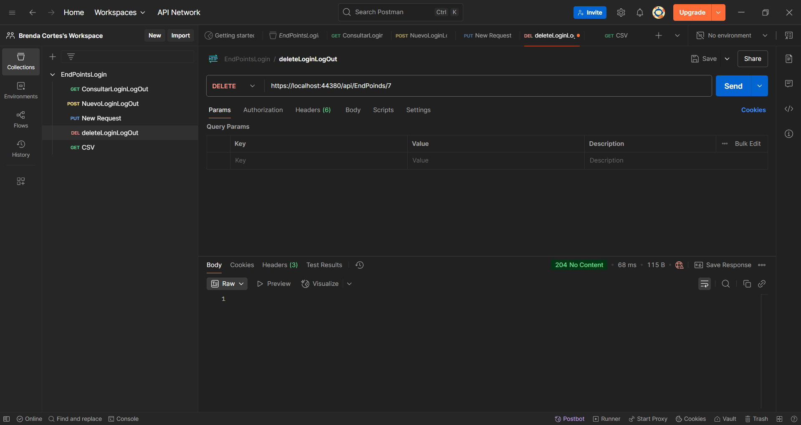

# EVALUACIÓN TÉCNICA NUXIBA

Prueba: **DESARROLLADOR JR**

Deadline: **1 día**

Nombre: BRENDA CORTES AGUILAR 

# NOTA 

-- Los archivos generados en la practica se encuentrane en la carpeta _ArchivosGenerados
_

---

## Clona y crea tu repositorio para la evaluación

1. Clona este repositorio en tu máquina local.
2. Crea un repositorio público en tu cuenta personal de GitHub, BitBucket o Gitlab.
3. Cambia el origen remoto para que apunte al repositorio público que acabas de crear en tu cuenta.
4. Coloca tu nombre en este archivo README.md y realiza un push al repositorio remoto.

---

## Instrucciones Generales

1. Cada pregunta tiene un valor asignado. Asegúrate de explicar tus respuestas y mostrar las consultas o procedimientos que utilizaste.
2. Se evaluará la claridad de las explicaciones, el pensamiento crítico, y la eficiencia de las consultas.
3. Utiliza **SQL Server** para realizar todas las pruebas y asegúrate de que las consultas funcionen correctamente antes de entregar.
4. Justifica tu enfoque cuando encuentres una pregunta sin una única respuesta correcta.
5. Configura un Contenedor de **SQL Server con Docker** utilizando los siguientes pasos:

### Pasos para ejecutar el contenedor de SQL Server

Asegúrate de tener Docker instalado y corriendo en tu máquina. Luego, ejecuta el siguiente comando para levantar un contenedor con SQL Server:

```bash
docker run -e 'ACCEPT_EULA=Y' -e 'SA_PASSWORD=YourStrong!Passw0rd'    -p 1433:1433 --name sqlserver -d mcr.microsoft.com/mssql/server:2019-latest
```

###  EVIDENCIA PASO 5

Durante la configuración del entorno de desarrollo, se utilizó Docker sobre WSL, empleando una distribución Ubuntu.

Al inicio del proceso, se verificó que Docker estuviera correctamente instalado y en funcionamiento. Sin embargo, se presentó un inconveniente relacionado con la virtualización, lo cual impidió levantar Docker Desktop.

Uno de los problemas identificados fue que la conexión no lograba apuntar directamente a localhost. Debido a esto, se procedió a utilizar la dirección IP como alternativa para establecer la conexión. Cabe mencionar que, en la configuración, se dejó un comentario registrado con el parámetro correcto para futuras referencias y ajustes.

Finalmente, una vez finalizado el proceso de configuración, se verificó el estado de los contenedores ejecutando el comando docker ps.


6. Conéctate al servidor de SQL con cualquier herramienta como **SQL Server Management Studio** o **Azure Data Studio** utilizando las siguientes credenciales:
   - **Servidor**: localhost, puerto 1433
   - **Usuario**: sa
   - **Contraseña**: YourStrong!Passw0rd

---

###  EVIDENCIA PASO 6

Para el desarrollo y gestión de bases de datos en este proyecto, se eligió utilizar Azure Data Studio como entorno principal.


# Examen Práctico para Desarrollador Junior en .NET 8 y SQL Server

**Tiempo estimado:** 1 día  
**Total de puntos:** 100

---

## Instrucciones Generales:

El examen está compuesto por tres ejercicios prácticos. Sigue las indicaciones en cada uno y asegúrate de entregar el código limpio y funcional.

Además, se proporciona un archivo **CCenterRIA.xlsx** para que te bases en la estructura de las tablas y datos proporcionados.

[Descargar archivo de ejemplo](CCenterRIA.xlsx)

---

## Ejercicio 1: API RESTful con ASP.NET Core y Entity Framework (40 puntos)

**Instrucciones:**  
Desarrolla una API RESTful con ASP.NET Core y Entity Framework que permita gestionar el acceso de usuarios.

1. **Creación de endpoints**:
   - **GET /logins**: Devuelve todos los registros de logins y logouts de la tabla `ccloglogin`. (5 puntos)
   - **POST /logins**: Permite registrar un nuevo login/logout. (5 puntos)
   - **PUT /logins/{id}**: Permite actualizar un registro de login/logout. (5 puntos)
   - **DELETE /logins/{id}**: Elimina un registro de login/logout. (5 puntos)


2. **Modelo de la entidad**:  
   Crea el modelo `Login` basado en los datos de la tabla `ccloglogin`:
   - `User_id` (int)
   - `Extension` (int)
   - `TipoMov` (int) → 1 es login, 0 es logout
   - `fecha` (datetime)

3. **Base de datos**:  
   Utiliza **Entity Framework Core** para crear la tabla en una base de datos SQL Server basada en este modelo. Aplica migraciones para crear la tabla en la base de datos. (10 puntos)

## Observaciones – Ejercicio 1

Para este proceso, se optó por crear todo el modelado de la base de datos directamente desde el framework, utilizando migraciones. Se cumplieron los puntos esenciales del ejercicio: crear el modelo de datos, ejecutar las migraciones correspondientes y generar el controlador necesario para gestionar los endpoints.

Herramientas clave: se emplearon los paquetes Microsoft.EntityFrameworkCore y EntityFrameworkCore.SqlServer, ambos indispensables para el manejo y gestión de la base de datos.

Aunque una opción viable hubiera sido importar la base de datos utilizando el asistente (wizard) del gestor de bases de datos y posteriormente mapear el modelo con el framework, se decidió crear el modelo manualmente para tener un mayor control sobre los errores potenciales relacionados con los tipos de datos y las relaciones que pueda tener nuestra estructura.

## Evidencias – Ejercicio 1

- **GET /logins**: Devuelve todos los registros de logins y logouts de la tabla `ccloglogin`


   - **POST /logins**: Permite registrar un nuevo login/logout.


   - **PUT /logins/{id}**: Permite actualizar un registro de login/logout.


   - **DELETE /logins/{id}**: Elimina un registro de login/logout. 




El modelo de la tabla ccloglogin tuvo una ligera modificación, ya que el campo User_id podía ser interpretado como una llave foránea en lugar de una llave primaria. Por este motivo, se ajustó el modelo para reflejar correctamente su rol dentro de la estructura de datos y evitar posibles inconsistencias en las relaciones entre tablas.

4. **Validaciones**:  
   Implementa las validaciones necesarias para asegurar que las fechas sean válidas y que el `User_id` esté presente en la tabla `ccUsers`. Además, maneja errores como intentar registrar un login sin un logout anterior. (10 puntos)

5. **Pruebas Unitarias** (Opcional):  
   Se valorará si incluyes pruebas unitarias para los endpoints de tu API utilizando un framework como **xUnit** o **NUnit**. (Puntos extra)

---

## Ejercicio 2: Consultas SQL y Optimización (30 puntos)

**Instrucciones:**

Trabaja en SQL Server y realiza las siguientes consultas basadas en la tabla `ccloglogin`:

## Observaciones – Ejercicio 3

 Dado que para el ejercicio inicial se manejó el modelo siguiendo el ejemplo adjunto, levantándolo completamente desde el framework, se optó por crear una segunda base de datos e importar el modelo tal como se especificaba en el archivo Excel. Esto se realizó con la finalidad de contar con los registros originales y asegurar que las pruebas realizadas durante el desarrollo de la API no se vieran afectadas por los cambios o ajustes implementados en el proceso.

De igual manera, se adjunta un archivo con la sintaxis SQL correspondiente, el cual respalda la estructura y definición de la base de datos utilizada.


1. **Consulta del usuario que más tiempo ha estado logueado** (10 puntos):
   - Escribe una consulta que devuelva el usuario que ha pasado más tiempo logueado. Para calcular el tiempo de logueo, empareja cada "login" (TipoMov = 1) con su correspondiente "logout" (TipoMov = 0) y suma el tiempo total por usuario.


   Ejemplo de respuesta:  
   - `User_id`: 92  
   - Tiempo total: 361 días, 12 horas, 51 minutos, 8 segundos

###  Respuesta Ejercicio 2.1 

```bash
SELECT TOP 1
    sub.User_id,
    CAST(SUM(sub.SegundosSesion) / 86400 AS VARCHAR) + ' días, ' +
    CAST((SUM(sub.SegundosSesion) % 86400) / 3600 AS VARCHAR) + ' horas, ' +
    CAST((SUM(sub.SegundosSesion) % 3600) / 60 AS VARCHAR) + ' minutos, ' +
    CAST(SUM(sub.SegundosSesion) % 60 AS VARCHAR) + ' segundos' AS [Tiempo total]
FROM (
    SELECT
        logs.User_id,
        logs.TipoMov,
        DATEDIFF(SECOND, logs.fecha, LEAD(logs.fecha) OVER (PARTITION BY logs.User_id ORDER BY logs.fecha)) AS SegundosSesion,
        LEAD(logs.TipoMov) OVER (PARTITION BY logs.User_id ORDER BY logs.fecha) AS NextTipoMov
    FROM ccloglogin AS logs
) AS sub
WHERE sub.TipoMov = 1 AND sub.NextTipoMov = 0
GROUP BY sub.User_id
ORDER BY SUM(sub.SegundosSesion) DESC;

```
###  Evidencia  2.1 


2. **Consulta del usuario que menos tiempo ha estado logueado** (10 puntos):
   - Escribe una consulta similar a la anterior, pero que devuelva el usuario que ha pasado menos tiempo logueado.

   Ejemplo de respuesta:  
   - `User_id`: 90  
   - Tiempo total: 244 días, 43 minutos, 15 segundos


   ###  Ejercicio   2.2

   
```bash
SELECT TOP 1
    sub.User_id,
    CAST(SUM(sub.SegundosSesion) / 86400 AS VARCHAR) + ' días, ' +
    CAST((SUM(sub.SegundosSesion) % 86400) / 3600 AS VARCHAR) + ' horas, ' +
    CAST((SUM(sub.SegundosSesion) % 3600) / 60 AS VARCHAR) + ' minutos, ' +
    CAST(SUM(sub.SegundosSesion) % 60 AS VARCHAR) + ' segundos' AS [Tiempo total]
FROM (
    SELECT
        logs.User_id,
        logs.TipoMov,
        DATEDIFF(SECOND, logs.fecha, LEAD(logs.fecha) OVER (PARTITION BY logs.User_id ORDER BY logs.fecha)) AS SegundosSesion,
        LEAD(logs.TipoMov) OVER (PARTITION BY logs.User_id ORDER BY logs.fecha) AS NextTipoMov
    FROM ccloglogin AS logs
) AS sub
WHERE sub.TipoMov = 1 AND sub.NextTipoMov = 0
GROUP BY sub.User_id
HAVING SUM(sub.SegundosSesion) > 0
ORDER BY SUM(sub.SegundosSesion) ASC;


```

   ###  Evidencia   2.2


3. **Promedio de logueo por mes** (10 puntos):
   - Escribe una consulta que calcule el tiempo promedio de logueo por usuario en cada mes.

   Ejemplo de respuesta:  
   - Usuario 70 en enero 2023: 3 días, 14 horas, 1 minuto, 16 segundos

###  Ejercicio   2.3

```bash

SELECT
    sub.User_id,
    FORMAT(sub.FechaLogin, 'yyyy-MM') AS Mes,
    CAST(AVG(sub.SegundosSesion) / 86400 AS VARCHAR) + ' días, ' +
    CAST((AVG(sub.SegundosSesion) % 86400) / 3600 AS VARCHAR) + ' horas, ' +
    CAST((AVG(sub.SegundosSesion) % 3600) / 60 AS VARCHAR) + ' minutos, ' +
    CAST(AVG(sub.SegundosSesion) % 60 AS VARCHAR) + ' segundos' AS [Promedio de sesión]
FROM (
    SELECT
        logs.User_id,
        logs.fecha AS FechaLogin,
        DATEDIFF(SECOND, logs.fecha, LEAD(logs.fecha) OVER (PARTITION BY logs.User_id ORDER BY logs.fecha)) AS SegundosSesion,
        LEAD(logs.TipoMov) OVER (PARTITION BY logs.User_id ORDER BY logs.fecha) AS NextTipoMov
    FROM ccloglogin AS logs
) AS sub
WHERE sub.NextTipoMov = 0
GROUP BY sub.User_id, FORMAT(sub.FechaLogin, 'yyyy-MM')
ORDER BY sub.User_id, Mes;

```


###  Evidencia   2.3


## Ejercicio 3: API RESTful para generación de CSV (30 puntos)

## Observaciones – Ejercicio 3

 Para este ejercicio se decidió regresar a trabajar con la base de datos inicial. Únicamente se ingresó un registro con el objetivo de poder generar un resultado válido y verificar el funcionamiento del proceso solicitado.

**Instrucciones:**

1. **Generación de CSV**:  
   Crea un endpoint adicional en tu API que permita generar un archivo CSV con los siguientes datos:
   - Nombre de usuario (`Login` de la tabla `ccUsers`)
   - Nombre completo (combinación de `Nombres`, `ApellidoPaterno`, y `ApellidoMaterno` de la tabla `ccUsers`)
   - Área (tomado de la tabla `ccRIACat_Areas`)
   - Total de horas trabajadas (basado en los registros de login y logout de la tabla `ccloglogin`)

   El CSV debe calcular el total de horas trabajadas por usuario sumando el tiempo entre logins y logouts.

   
   

   No fue posible identificar de manera clara dónde generaba Postman los archivos descargados desde los endpoints, ya que la herramienta únicamente ofrecía la opción manual de guardar la respuesta mediante el botón Save Response, sin gestionar automáticamente la ubicación del archivo.


2. **Formato y Entrega**:
   - El CSV debe ser descargable a través del endpoint de la API.
   - Asegúrate de probar este endpoint utilizando herramientas como **Postman** o **curl** y documenta los pasos en el archivo README.md.


   Se emplearon tanto Postman como la herramienta de Swagger disponible en el framework para realizar las pruebas de los endpoints. Dado que no se había trabajado previamente en la creación de APIs con .NET, el uso de Swagger resultó especialmente útil, ya que permitió comprender mejor el funcionamiento de las rutas y operaciones, ofreciendo además una visualización más clara e intuitiva del comportamiento de la API.

   Como alternativa, se optó por utilizar Swagger, integrado en el framework, ya que este sí ofrecía directamente un enlace de descarga en la interfaz, facilitando así la obtención de los archivos generados por los endpoints durante las pruebas.


---

## Entrega

1. Sube tu código a un repositorio en GitHub o Bitbucket y proporciona el enlace para revisión.
2. El repositorio debe contener las instrucciones necesarias en el archivo **README.md** para:
   - Levantar el contenedor de SQL Server.
   - Conectar la base de datos.
   - Ejecutar la API y sus endpoints.
   - Descargar el CSV generado.
3. **Opcional**: Si incluiste pruebas unitarias, indica en el README cómo ejecutarlas.

---

Este examen evalúa tu capacidad para desarrollar APIs RESTful, realizar consultas avanzadas en SQL Server y generar reportes en formato CSV. Se valorará la organización del código, las mejores prácticas y cualquier documentación adicional que proporciones.
